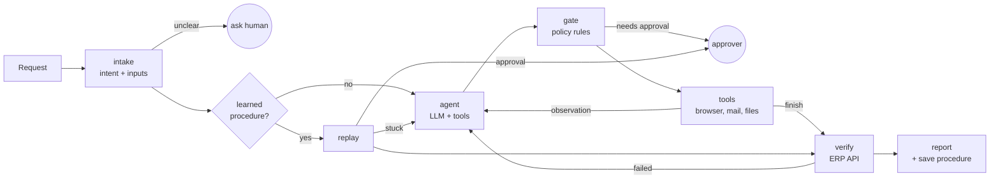

# AI Operator: a company request in, verified work out

A prototype AI employee for a fictional hospital, Sahyadri Care Hospital, Pune. You give it a request in plain language. It works out which company procedure applies, operates the company's apps through a real browser, pauses for human approval where policy requires it, checks the result against the system of record, and returns evidence.

It also learns. The first time it does a task, it reasons through it step by step. Once the result is verified, the steps are saved as a reusable procedure. The next similar request replays that procedure with 1 or 2 model calls instead of 8 to 10, and repairs it if the app has changed.

```
python run.py "Record the latest invoice from MedSupply Co in the ERP"
```

Everything runs against sandbox data. No real company systems or credentials.

## What it demonstrates

| Requirement | Where it happens |
|---|---|
| Understand the intended outcome | `intake`: request to a structured task (intent, goal, inputs), matched against company SOPs |
| Decide what needs to be done | The SOP for that intent is loaded as working instructions |
| Plan and select tools | Agent loop with tool calling over browser, mailbox, files, extraction, date tools |
| Execute and observe | Real Playwright browser. Every action returns a fresh page snapshot |
| Adapt and recover | Errors are observations. Replay retries 5xx, self-heals renamed UI elements, hands over to the agent when stuck |
| Maintain state | Run facts come from tool outputs. Full graph state is checkpointed to SQLite after every step |
| Ask for help or approval | LangGraph `interrupt()` for clarifying questions and policy approvals |
| Verify the outcome | Separate read-only ERP API checked against success criteria defined in the SOP |
| Return evidence | `runs/<id>/report.md`, `steps.jsonl`, screenshots |

## Setup

Requires Python 3.11+.

```bash
pip install -r requirements.txt
playwright install chromium
cp .env.example .env          # add your OPENROUTER_API_KEY and pick a MODEL
python -m sandbox.seed        # creates the mock ERP database, mailbox and shared drive
```

Start the sandbox ERP in one terminal:

```bash
uvicorn sandbox.erp_app:app --port 8800
```

Open http://127.0.0.1:8800 to see the app the agent operates.

## Run

```bash
# First time: the agent works it out (about 8 to 10 model calls). Asks for approval (amount > INR 50,000).
python run.py "Record the latest invoice from MedSupply Co in the ERP"

# Same kind of task, different vendor: replays the learned procedure (about 2 calls).
python run.py "Record the latest invoice from Apex Diagnostics in the ERP"

# Ambiguity: two CleanCare invoices arrived at the same time, so it asks which one.
python run.py "Record the latest invoice from CleanCare Linen in the ERP"

# Insurance: apply a TPA decision email to the claim. Run it again for CLM-2214 to see a replay
# with a different outcome (Query raised instead of Approved).
python run.py "Update claim CLM-2209 from the TPA's latest email"

# Look up the ERP and reply to a vendor. External email needs Accounts Manager approval.
python run.py "Reply to PharmaLink's payment status query"

# The operator is not allowed to add vendors. It should route the request to Procurement instead.
python run.py "SterilePro sent a vendor registration request, please handle it"

# Clinical operations: find the discharge summary by content (file names don't contain patient IDs),
# look up the department's follow-up interval in the protocol PDF, book it. Try P-107 next (Orthopedics, 14 days).
python run.py "Book the post-discharge follow-up for patient P-104"

# Document check: find the vendor's rate contract, compare invoice lines against it, email AP the result.
# MedSupply is overcharging on IV cannulas (21.50 vs 19.00). Apex matches.
python run.py "Check the latest MedSupply Co invoice against our rate contract"

# Plain question answered from company documents, with the source file and page.
python run.py "What are the payment terms in our contract with Apex Diagnostics?"

# Break the app and watch it recover: flaky 503s on submit, renamed form labels.
curl -X POST "http://127.0.0.1:8800/admin/reset"
curl -X POST "http://127.0.0.1:8800/admin/chaos?flaky_submit=true&rename_fields=true"
python run.py "Record the latest invoice from Apex Diagnostics in the ERP"
```

Sent emails land in `sandbox/data/outbox/` as .eml files. Reset everything with `python -m sandbox.seed`
(and restart the ERP).

## Workflows

Same runtime, same tools. Each workflow is an SOP in `company/sops/` plus whatever the sandbox apps need.

| Workflow | Sources | Actions | What it shows |
|---|---|---|---|
| Record a vendor invoice | Email + PDF attachment | ERP form | Extraction, duplicate check, approval above INR 50k, learn and replay, self-heal |
| Update an insurance claim | TPA email body | Edit an existing ERP record | Indian number format, choosing from fixed statuses, replay with a different outcome |
| Answer a vendor payment query | Vendor email | ERP lookup, reply email | Reading values off a page, external email approval, verifying the reply against the ERP |
| Route a vendor registration | Vendor email | Internal email | A forbidden action blocked in code, and the agent taking the allowed path instead |
| Book a discharge follow-up | Discharge summary PDF + follow-up protocol PDF, both found by content search | ERP appointment form | Finding documents without knowing file names, a rule looked up per department, date arithmetic |
| Check an invoice against the contract | Invoice PDF + rate contract PDF found by search | Email to AP manager | Model extracts line items, code does the comparison; flags MedSupply's IV cannula rate |
| Answer a question from documents | Contracts, manuals, protocols | None | Grounded answer with source file and page; reported as `answered`, not `verified` |

### Company documents (shared drive)

`sandbox/data/shared_drive/` holds the documents the operator has to find on its own:

| Folder | Documents |
|---|---|
| `contracts/` | Rate contracts for MedSupply Co and Apex Diagnostics, service agreement for CleanCare Linen (rates, payment terms, validity) |
| `manuals/` | Accounts Payable Manual (approval matrix, rate-check rule, payment runs), Procurement Manual (vendor onboarding checklist) |
| `clinical/` | Post-discharge follow-up protocol (interval per department) |
| `discharge_summaries/` | Three summaries with opaque file names like `DS_2026_0412.pdf` |

`search_documents` runs BM25 over page-level chunks of every document, locally with no model calls, and returns path, page and snippet. Discovery (which document, which page) and execution (what to do with it) are separate steps, and both show up in the step log.

Options: `HEADED=1` shows the browser (useful for the demo video). `--auto-approve` skips approval prompts. `--no-procedures` forces the agent path. `--resume <run_id>` continues an interrupted run.

### Offline test (no API key needed)

```bash
python -m sandbox.seed && python tests/test_offline_e2e.py
```

Runs the policy rules and the scenarios below against the real ERP, browser, gate, verifier and procedure memory, with a scripted stand-in for the model's decisions: invoice learn with approval, replay for a new vendor, self-heal plus retry under chaos, claim update learn and replay with a different outcome, vendor reply with approval, blocked vendor creation routed to Procurement, invoice-vs-contract checks (mismatch and match), discharge follow-ups for two departments found through document search, a question answered from documents, and a declined approval that leaves the ERP unchanged. This tests the runtime, not model quality.

## Architecture



```
ai_operator/
  graph.py        LangGraph runtime: intake, route, agent, gate, tools, replay, approve, verify, report
  procedures.py   compile verified traces into parameterized procedures; replay helpers; self-heal
  policy.py       deterministic policy gate over company/rules.yaml
  verifier.py     independent checks against the ERP's read-only API
  knowledge.py    SOP loading and BM25 retrieval, policies, rules
  llm.py          OpenRouter client with disk cache, call counter, fallback models
  evidence.py     run directory, step log
  tools/
    browser.py    Playwright with text snapshots, element refs, read_field
    registry.py   tool schemas, risk levels, handlers (browser, mail search/send, document search,
                  extraction, line-item comparison, dates)
company/          SOPs (with machine-readable success checks), policies, rules.yaml
sandbox/          mock hospital ERP (FastAPI: payables, claims, appointments, vendors) and seed data
                  (mailbox, PDFs, shared drive, outbox)
```

### The loop

1. **Intake.** One model call turns the request into `{intent, goal, entities}`, choosing from SOPs retrieved with BM25. If a required input is missing, it asks.
2. **Route.** If a verified procedure exists for this intent, replay it. Otherwise run the agent.
3. **Agent.** Tool-calling loop. The system prompt carries the SOP, policies and run facts. Each browser action returns the new page state, so observing costs no extra call. Older snapshots are trimmed from the context.
4. **Gate.** Before any pending action runs, it is checked against `company/rules.yaml`. Approvals and questions pause the graph with `interrupt()`. Because the gate runs before execution, resuming never repeats a side effect.
5. **Verify.** When the agent calls `finish`, the verifier reads the ERP through its API and compares the record with the SOP's success checks, filled with facts observed from documents. If it fails, the failure goes back to the agent (up to 2 attempts).
6. **Report and learn.** Writes the report. If verified, the trace is compiled into a procedure and saved.

## Design decisions

**Company context defines "done".** Each SOP has frontmatter with success checks, for example "a payable exists with this invoice number, and its amount and due date match the PDF." The agent does not decide its own success criteria and does not grade its own work.

**Verify through a different channel than the one used to act.** The agent writes through the browser UI. The verifier reads through the API. A form that looked submitted but was not saved, or was saved with a typo, fails verification.

**Only this run's work counts.** A matching record or email that existed before the run started fails verification. Without this, a run that never pressed save could "pass" on a record someone entered earlier, and a broken procedure would be learned from it. (Found during real-model testing: a pre-existing manual entry let a procedure with no save step pass.)

**Facts come from observations, not from the model's text.** `extract_fields` writes values into run memory, and verification uses those values. The prompt also tells the model never to type a value it did not observe.

**Policy is enforced in code.** The model reads the policies, but `policy.py` checks every action (agent or replay) against `rules.yaml` before it runs. Rules match on tool, page, element name, arguments and run facts. Current rules: no deletions, no vendor master changes, no patient IDs in external email, approval for external email, approval for payables above INR 50,000. A model that ignores the approval rule still cannot save a INR 68,450 payable without a human. Unknown values on a guarded action fail safe and ask for approval. Navigation outside the company app and file access outside the shared drive are blocked in the tools.

**The model reads, code decides.** For document checks, the model only extracts line items from the invoice and the contract. Matching items and comparing rates happen in code (`compare_line_items`), so the result that goes to AP is reproducible, and the verifier can check that the email states it.

**Discovery is a first-class step.** The operator is never handed a file path. It finds discharge summaries, contracts and protocols with `search_documents`, and the SOP tells it what to look for, not where. Learned procedures keep those searches parameterized (`"{{patient_id}} discharge summary"`, `"follow-up protocol {{department}}"`), so a replay for another patient finds that patient's documents.

**Text snapshots instead of screenshots.** The browser tool returns page text plus interactive elements with short refs (`[e7] textbox "Amount (INR)"`), the same approach as Playwright MCP's accessibility snapshots. It costs far fewer tokens than images, works with models that cannot see, and the agent clicks an exact element instead of guessing coordinates.

**Learn once, replay after.** Computer-use agents usually re-reason every run, which is slow and costly. Here a verified run is compiled into a procedure:
- element refs become `(role, accessible name)`, which survives re-renders
- values equal to run facts become `{{amount}}`, `{{vendor}}`
- values produced by an earlier step become `{{s0.results.0.attachments.0}}`

Replay calls the model only where a step needs it (document extraction) or when something breaks. Similar idea to browser-use's workflow-use and OpenAdapt.

**Replay knows when to stop.** It retries 5xx errors with backoff, but not 4xx errors like a duplicate invoice, since retrying will not help. If an element is missing, one model call re-locates it and the procedure is patched (saved as a new version once verified). If a tool reports a decision point, such as two "latest" invoices with the same timestamp, or the page is not where the procedure expects, replay hands over to the agent from the current state instead of guessing.

**Durable state.** LangGraph checkpoints to SQLite after every node. A run waiting for approval can wait indefinitely, and a crashed run can be resumed with `--resume`.

**Built for a small request budget.** OpenRouter's free tier allows 50 requests a day without credits. A disk cache serves identical requests for free, so re-running a scenario while developing costs nothing, and replays bring repeat tasks down to about 2 calls.

## Models, frameworks, services

- Model: any OpenRouter model with tool calling, set in `.env` (`MODEL`, optional `FALLBACK_MODELS`). Uses the OpenAI SDK against OpenRouter's compatible API.
- LangGraph (state graph, `interrupt()`, SQLite checkpointer)
- Playwright (Chromium) for browser control
- FastAPI and Uvicorn for the mock ERP
- rank_bm25 for SOP retrieval, pypdf for PDF text, reportlab for generating sandbox PDFs
- AI coding assistants were used while building this.

## Assumptions

- The company's apps are web apps reachable from the operator's machine. The sandbox ERP stands in for a real ERP or HIS.
- SOPs exist as text, and the steps that matter for verification can be written as checks against a system of record.
- The requester is a staff member allowed to start these tasks. Approvers answer in the same terminal.
- Sandbox data only. Patient names and records are fictional.

## Known limitations

- Desktop apps are not supported. The tool interface would take a desktop backend (OS accessibility APIs) without changes to the runtime, but none is built.
- Procedures are linear. No loops or branches yet, so "record all invoices from last week" runs through the agent each time.
- Recorded traces are not minimized. Exploratory steps from the first run are kept if they succeeded, including harmless steps around a blocked attempt.
- Document search is BM25 (keyword). It works for this corpus; a larger one would need embeddings and a reranker.
- Answers to document questions are grounded and cited, but not checked by a second pass.
- The mailbox and outbox are folders of .eml files, not a mail server.
- Templating matches values by equality. A value that coincidentally equals a fact could be parameterized by mistake.
- Approvals happen in the CLI. There is no approver identity or authentication.
- Tasks without an SOP still run, but finish as `completed_unverified`, since there are no success checks to run.
- The ERP has no login. Session handling and secret injection are not covered.
- One task at a time. No queue or scheduler.

## What I would build next

1. A task queue with workers, so requests run in the background with retries and schedules. The checkpointer already makes runs resumable.
2. Approvals through Slack or email, with approver identity and an audit trail.
3. Procedures as programs, with loops and branches inferred from several runs, and a review step before a new procedure goes live.
4. A per-company knowledge layer: hybrid search (BM25 + embeddings) with a reranker over documents, SOPs and past runs, plus OCR for scanned PDFs.
5. Desktop and API connectors behind the same tool interface, with per-tool permissions.
6. An eval set of tasks with injected failures, tracking success rate, model calls per task and approval rate over time. Tracing through LangSmith or OpenTelemetry.
